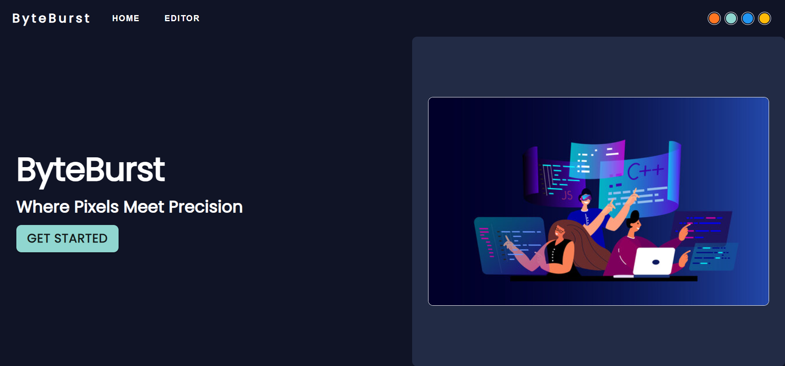
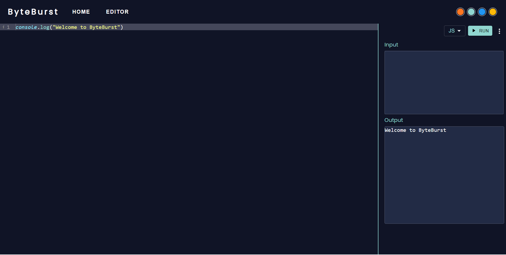

# ByteBurst
ByteBurst is an innovative online compiler designed to streamline coding experiences. With support for 6 programming languages, versatile text themes, and seamless code saving and download options, ByteBurst is your go-to platform for coding endeavors.

 

# Features:
1) Multi-Language Support: Code in 6 different programming languages.
2) Versatile Text Themes: Choose from multiple text themes for personalized coding.
3) Effortless Saving & Download: Save your code or download it with ease.
4) Responsive UI: Enjoy an intuitive and adaptable user interface.

# Usage:
1) Select Your Language: Choose from the supported programming languages.
2) Theme Personalization: Customize your coding environment with diverse text themes.
3) Save & Download: Save your code for later or download it directly.
4) Responsive UI: Experience seamless coding on any device with ByteBurst's responsive design.

# Technologies Used:
1) ReactJs
2) NodeJs
3) ExpressJs

# Live Website :- 
https://byteburst.netlify.app
